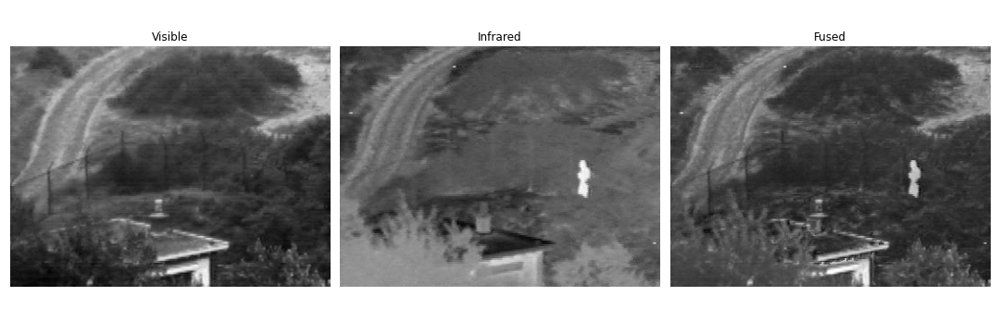
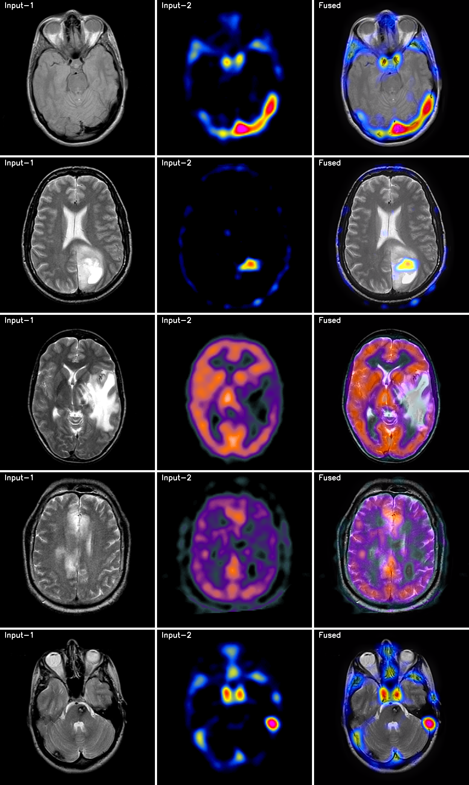

# Fast and Efficient Zero-Learning Image Fusion

This repository provides an **opencv** and **pytorch** implementation of the paper "[Fast and Efficient Zero-Learning Image Fusion](https://arxiv.org/abs/1905.03590)".


## Usage

```bash
pip install -r requirements.txt
cd code/
# --imageSource specify a sequence of source images to be fused
python main.py --imagePath=../images/IV_images --imageSource "VIS*.png" "IR*.png"
python main.py --imagePath=../images/MRI-PET --imageSource "MRI*.png" "PET*.png"
```

In the above example, `VIS01.png` will be fused with `IR01.png`,  `VIS02.png` will be fused with `IR02.png`, etc. 

Fusion of 1 RGB with multiple IR images are supported, just add the glob pattern of images in `--imageSource`.


## Results 

#### Visible and infrared Image fusion



#### Grayscale and RGB image fusion




## License
This project is licensed under the MIT License.

[MIT](./LICENSE) &copy; bsun


